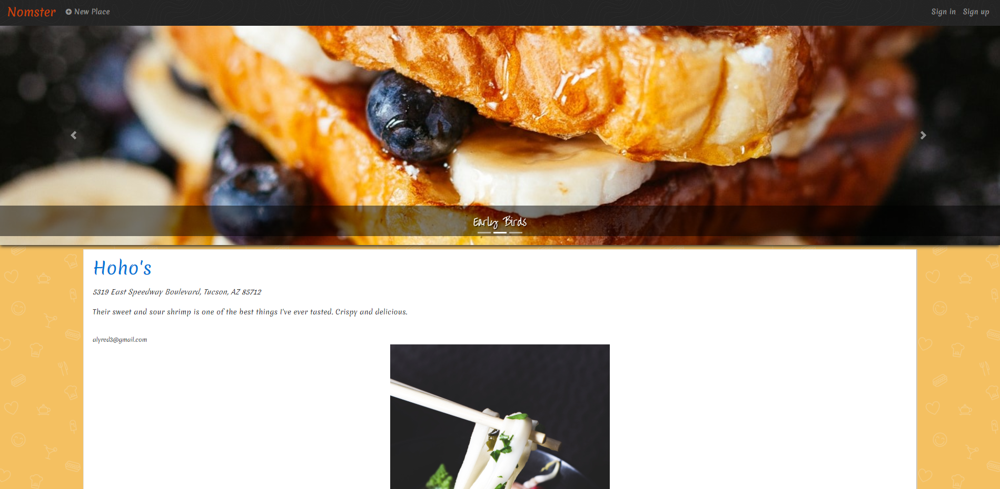
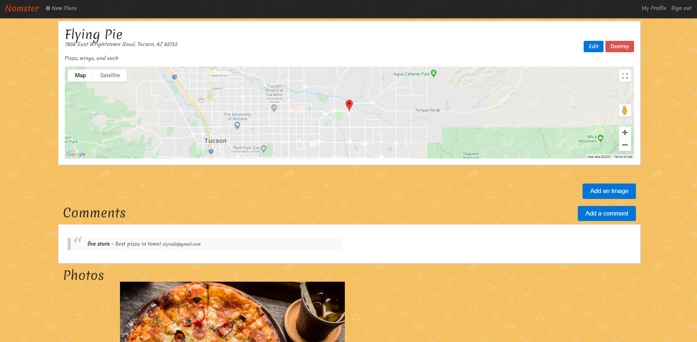
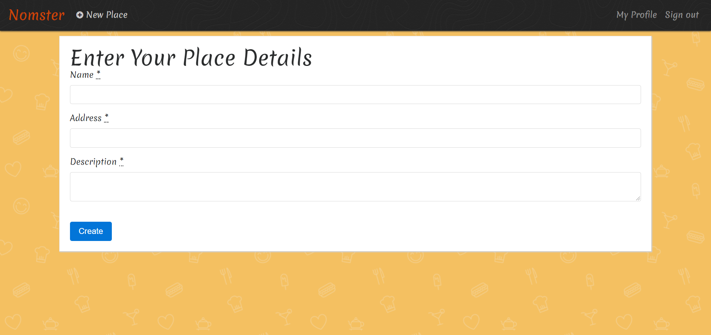

# Nomster

A Yelp clone that integrates with the Google API and includes features such as user comments, user authentication, star ratings and image uploads.

[View the deployed application]https://nomster-alyssa-redman.herokuapp.com/

__

###Features

* Ruby 2.5.3

* jQuery

* PostgresSQL

* TwitterBootstrap3 for CSS

* Devise for user authentication

* Geocoder gem with Google Geocoding API to display maps

* Simple Form gem for generating new entries

* Amazon Web Services(AWS) photo storage

* Will Paginate gem for page pagination

__

###Screenshots

