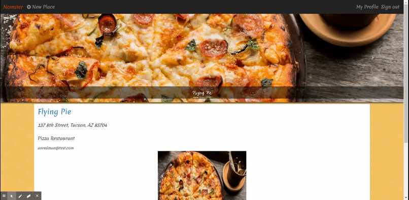

# Nomster

A Yelp clone that integrates with the Google API and includes features such as user comments, user authentication, star ratings, and image uploads.

[View the deployed application](https://nomster-alyssa-redman.herokuapp.com/)

______

### Features

* Ruby 2.5.3

* jQuery, Bootstrap, CSS

* PostgresSQL

* Devise for user authentication

* Geocoder gem with Google Geocoding API to display maps

* Figaro gem to securly confiure app

* Simple Form gem for generating new entries

* Amazon Web Services(AWS) photo storage

* Will Paginate gem for page pagination

_____

### Installation 

Clone with SSH 'git@github.com:alyred3/nomster.git' or

Clone with HTTPS 'https://github.com/alyred3/nomster.git'

Run 'git clone git@github.com:alyred3/nomster.git' or 'git clone https://github.com/alyred3/nomster.git' in local command line

Run 'bundle install'

Run 'rbenv rehash'

Run 'figaro install'

To integrate with Google Geocoding API replace the 'YOUR_API_KEY_HERE' with the API key you have listed on your google account in 'config/application.yml'.

### How to use

#### Creating an account

#### Adding a new place

#### Adding images, comments, and ratings

#### Track places and comments in user profile

#### Editing and deleting 

