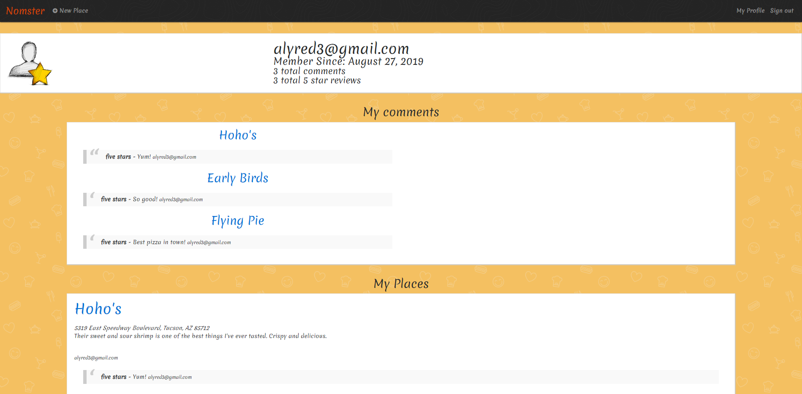

# Nomster

A Yelp clone that integrates with the Google API and includes features such as user comments, user authentication, star ratings, and image uploads.

[View the deployed application](https://nomster-alyssa-redman.herokuapp.com/)

______

### Features

* Ruby 2.5.3

* jQuery, Bootstrap, CSS

* PostgresSQL

* Devise for user authentication

* Geocoder gem with Google Geocoding API to display maps

* Simple Form gem for generating new entries

* Amazon Web Services(AWS) photo storage

* Will Paginate gem for page pagination

### How to use

Guests can view local restuarant's reviews, ratings, and maps. Users can add new restaurants, upload images, leave reviews, and give ratings. A user can view their places and comments on their user profile, where they can navigate to pages to delete or edit.  
____

### Screenshots

